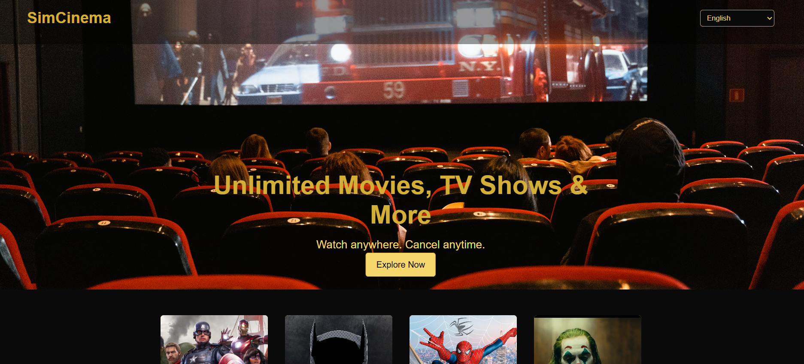
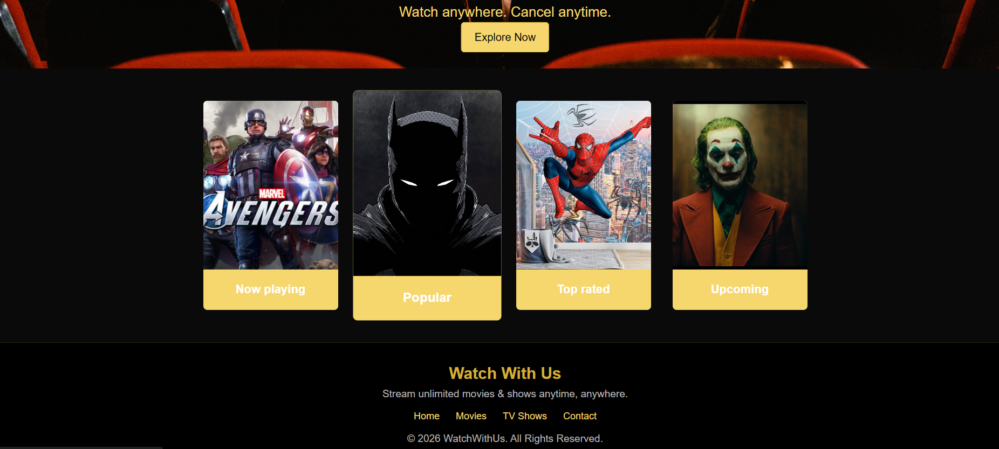
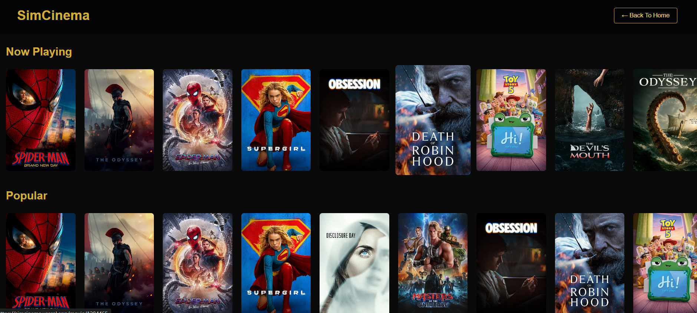
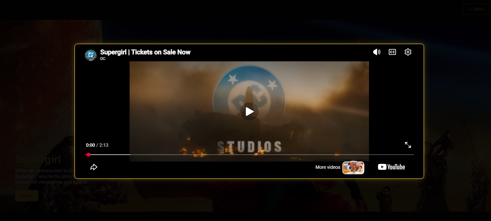

# 🎬 SimCinema

SimCinema is a modern movie discovery web application built with **React.js** that allows users to explore movies through an interactive and responsive interface. The application fetches real-time movie data using the **TMDB (The Movie Database) API** and provides features such as multilingual support, category-based browsing, movie details, and online/offline status detection.

---

## 🚀 Live Demo

🔗 https://simcinema.vercel.app/

---

## 📸 Preview

### Home Page
> 


### Movie Page


### Movie Details

---

## ✨ Features

- 🎥 Browse movies by different categories
- 📄 View detailed information about each movie
- 🌍 Multilingual support (English & Hindi)
- ⚡ Dynamic routing using React Router
- 📱 Responsive user interface
- 🌐 Detects online/offline network status
- ♻️ Reusable React components
- 🚀 Deployed on Vercel

---

## 🛠️ Tech Stack

### Frontend
- React.js
- JavaScript (ES6+)
- JSX
- HTML5
- CSS3

### React Features
- React Router DOM
- React Hooks
  - useState
  - useContext
  - useEffect
- Context API
- Custom Hooks

### API
- TMDB (The Movie Database) API

### Development Tools
- Vite
- Visual Studio Code
- Git
- GitHub

### Deployment
- Vercel

---

## 📂 Project Structure

```text
SimCinema
│
├── public/
│
├── src/
│   ├── assets/
│   ├── components/
│   │   ├── Header.jsx
│   │   ├── Footer.jsx
│   │   ├── Movies.jsx
│   │   ├── MovieCard.jsx
│   │   ├── MovieDisplay.jsx
│   │   ├── AllMovies.jsx
│   │   └── Error.jsx
│   │
│   ├── contexts/
│   │   └── LanguageContext.jsx
│   │
│   ├── hooks/
│   │   └── OnlineStatusCheck.js
│   │
│   ├── App.jsx
│   ├── main.jsx
│   ├── data.js
│   ├── index.css
│   └── App.css
│
├── .env
├── package.json
├── vite.config.js
└── README.md
```

---

## ⚙️ Installation

Clone the repository

```bash
git clone https://github.com/your-username/SimCinema.git
```

Navigate to the project directory

```bash
cd SimCinema
```

Install dependencies

```bash
npm install
```

Run the development server

```bash
npm run dev
```

---

## 🎯 Project Highlights

- Built using React's component-based architecture.
- Implemented dynamic routing with React Router.
- Used Context API for global language management.
- Created a custom hook to monitor online/offline status.
- Integrated TMDB API to fetch real-time movie information.
- Used reusable components to improve maintainability.
- Secured API keys using environment variables.
- Deployed the application using Vercel.

---

## 📖 What I Learned

Through this project, I gained hands-on experience with:

- React Components
- React Hooks
- Context API
- React Router DOM
- Custom Hooks
- API Integration
- Dynamic Routing
- Conditional Rendering
- State Management
- Responsive Web Design
- Environment Variables
- Deploying React Applications on Vercel

---

## 🔮 Future Improvements

- User authentication
- Movie search functionality
- Favorites/Watchlist feature
- Dark mode
- Pagination or infinite scrolling
- Trailer integration
- Movie recommendations

---

## 👩‍💻 Author

**Simran Rawat**


---

⭐ If you found this project helpful, consider giving it a star!
